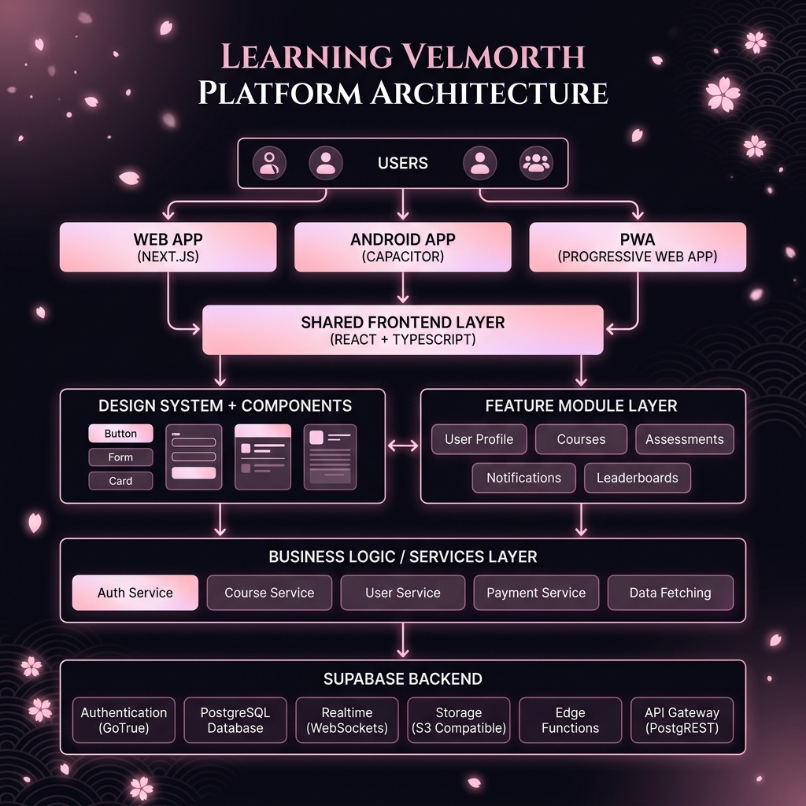

# 🌸 MindForge — Powered by Yample Labs

[](https://nextjs.org/)
[](https://tailwindcss.com/)
[](https://supabase.com/)
[](#license)

**MindForge** is a premium, high-fidelity AI-powered Japanese learning application developed by **Yample Labs** (Founded by **Manish**). Featuring a curated Sakura-Pink + Purple gradient design system with modern glassmorphism UI structures, this codebase delivers a unified responsive experience designed for both desktop web browsers and mobile wrapper viewports.

---

## 🎨 Design System & Theme

Our visual guidelines are built for a modern, responsive, and gorgeous user experience:
- **Branding Palette:** Curated Sakura-pink + Purple gradient themes. Slick, clean dark mode configurations.
- **Micro-Animations:** Fluid 60 FPS transitions using **Framer Motion** spring physics, featuring floating animations for the Sakura AI avatar widget and haptic touch ripples.
- **Typography:** Modern typographic scale with an emphasis on readable hierarchy tailored to both Japanese scripts (Kanji, Hiragana, Katakana) and standard translation texts.
- **Capacitor & Android Safe Area:** Custom padding variables (`env(safe-area-inset-top)` / `env(safe-area-inset-bottom)`) ensure elements lay out perfectly on modern notch and status-bar viewports.

---

## 🚀 Key Features & Modules

### 1. 🤖 Sakura AI Tutor Mascot
An interactive virtual AI tutor mascot widget powered by Google Generative AI (Gemini). Accessible dynamically on learning pages and conversation panels to guide the student's journey.

### 2. 📅 Spaced Repetition (SRS) Engine
An implementation of the classic **SM-2 Algorithm** in `src/domain/srs-engine.ts`. Adaptively schedules vocabulary reviews:
* Correct answers scale learning intervals.
* Weak vocabulary cards are automatically clustered.
* Dynamic difficulty shifts matching the student's mastery rate.

### 3. 🔥 Streak & Protection Engine
Maintains learning consistency via `src/domain/streak-engine.ts`.
* Automatic daily streak tracking.
* Streak Shield usage rules when learners miss a day.
* Shop integration to buy streak freezes using earned rewards.

### 4. ⭐ XP & Mastery Tracker
Calculates custom XP awards and mastery delta for each completed session via `src/domain/xp-engine.ts`, adjusting XP based on completion score, streak multipliers, and lesson difficulty.

### 5. 🏅 Achievements & Leagues
* **Achievements (`src/domain/achievement-engine.ts`):** Evaluates progress data against target badge definitions to unlock milestones.
* **Daily Goals (`src/domain/daily-goal-engine.ts`):** Programmatically generates and scores custom daily tasks.
* **Leagues (`src/domain/league-engine.ts`):** Dynamic user leagues with promotion/relegation thresholds and automated cycle resets.

---

## 📁 Repository Structure

```
├── .agents/                    # Workspace customization and rules
├── docs/                       # Project documentation
├── scripts/                    # Database seeding and configuration scripts
├── supabase/                   # Supabase configuration files
├── src/
│   ├── app/                    # Next.js App Router folders & pages
│   │   ├── (app)/              # Application Shell pages
│   │   │   ├── ai-tutor/       # AI Tutor chat panel
│   │   │   ├── home/           # Main student dashboard
│   │   │   ├── path/           # Core learning path lessons
│   │   │   ├── kanji/          # Kanji stroke/writing boards
│   │   │   └── ...             # Achievements, Leaderboard, Shop, Quiz, Profile
│   │   ├── auth/               # Login & Registration workflows
│   │   └── globals.css         # Tailwind v4 main stylesheet
│   ├── components/             # Reusable UI & Layout components
│   │   ├── layout/             # Core layouts (AppShell)
│   │   └── ui/                 # Atomic design inputs (Button, Logo, Input, etc.)
│   ├── domain/                 # Core domain logic (SRS, XP, Streak engines)
│   ├── services/               # State layer and API orchestration
│   └── types/                  # Shared TypeScript models
└── package.json                # Project script configuration & dependencies
```

---

## 🛠️ Setup & Running Locally

Follow these steps to get a local copy up and running quickly.

### 📋 Prerequisites

Before you begin, ensure you have the following installed on your machine:
- **[Node.js](https://nodejs.org/)** (v22.0.0 or higher)
- **[pnpm](https://pnpm.io/)** v8+ (Preferred package manager)
- **Git**

### 💻 Installation

**1. Clone the repository:**
```bash
git clone https://github.com/manish63018-sketch/learn-with-velmorth.git
cd learn-with-velmorth
```

**2. Install project dependencies:**
```bash
pnpm install
```

### 🚀 Running the Development Server

Start the development server with Hot-Module Replacement:
```bash
pnpm dev
```
Navigate to [http://localhost:3000](http://localhost:3000) in your browser. The application will automatically reload if you change any of the source files.

### 🏗️ Build for Production

To build the application for production and serve the optimized build:
```bash
pnpm build
pnpm start
```

---

# Architecture Overview



Learn more about the platform's architecture in the **docs/architecture.md** file.

---

## 🔒 Copyright & License
© 2026 Yample Labs. All Rights Reserved.

This codebase is proprietary software developed by Yample Labs (Founded by Manish). All rights reserved.
